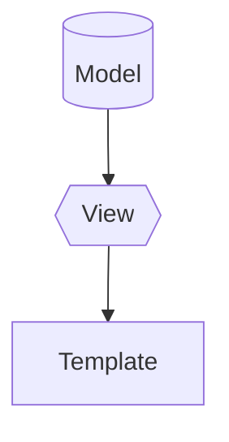

## Starting a  Django Project 
1. Create a virtualenv using `uv` 
```bash 
uv init Blogapp 
```
2. Install Django 
```bash
uv add django
```
3. Starting a Django project 
```bash
uv run python -m django-admin startproject Blogapp .
```
4. Run the server 
```bash
uv run python manage.py runserver
```

## understanding about the project structure
1. `manage.py` - A command-line utility that lets you interact with this Django project in various ways. You can read all the details about manage.py in django documentation.
2. `Blogapp/` - This is the actual Python package for your project. Its name is the same as your project. It contains the settings for your project, as well as the main URL configurations and WSGI application. 
3. `__init__.py` - An empty file that tells Python that this directory should be considered a Python package.
4. `settings.py` - This file contains all the settings for your Django project. You can read more about it in the django documentation.
5. `urls.py` - This file contains the URL declarations for this Django project; a "table of contents" of your Django-powered site. You can read more about it in the django documentation.
6. `wsgi.py` - An entry-point for WSGI-compatible web servers to serve your project. You can read more about it in the django documentation.


## MVT structure of Django
1. Model - The model is the single, definitive source of information about your data. It contains the essential fields and behaviors of the data you’re storing. Generally, each model maps to a
single database table. You can read more about it in the django documentation.
2. View - The view is the user interface - what you see in your browser when you
access a Django-powered site. It’s the presentation layer which handles the user interface part of the application. You can read more about it in the django documentation.
3. Template - The template is the presentation layer which handles the user interface part of the application
You can read more about it in the django documentation.



```python 
print("Hello World")

if 5 > 3:
    print("5 is greater than 3")
    print("This is a simple Django project")

```home ma forms.py 
import .models from product,django.forms modelform

#xyz@gmail.com,  1234      
#email:a@gmail.com pwd: 11  (admin)
#k@gmail.com , 0000
